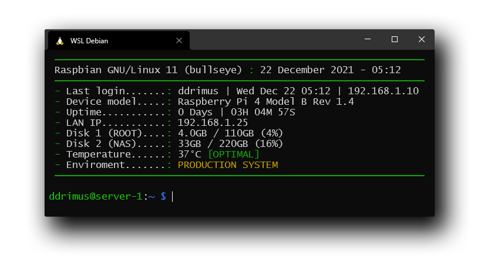

  

`Simple-MOTD` is a script that displays useful informations about your servers as soon as you login into the shell. The script was designed and optimized for devices that have little computing power. In particular, the script was created for Raspberry devices.

---

### Pre-installation
Disable any kind of preconfigured MOTD:
~~~bash
sudo nano /etc/ssh/sshd_config
UsePAM no #UsePAM slows the login, so simple-motd doesn't use it.
PrintMOTD no #PrintMOTD is used only in case of static MOTD.
PrintLastLog no #PrintLastLog is implemented inside the simple-motd, so it is not needed.
~~~

---

### Installation
To install the latest version of `Simple-MOTD` choose one of this options:

#### All in one:
~~~bash
sudo apt install -y git && git clone https://github.com/ddrimus/simple-motd && sudo mv simple-motd/motd.sh /etc/motd.sh && sudo chmod 775 /etc/motd.sh && sudo rm -r simple-motd && sudo printf "# MOTD\n/etc/motd.sh\n" | sudo tee -a /etc/profile  > /dev/null 2>&1 && echo "Simple-MOTD installed"
~~~

#### Step by step:
~~~bash
sudo apt install -y git
git clone https://github.com/ddrimus/simple-motd
sudo mv simple-motd/motd.sh /etc/motd.sh
sudo chmod 775 /etc/motd.sh
sudo rm -r simple-motd
sudo printf "# MOTD\n/etc/motd.sh\n" | sudo tee -a /etc/profile  > /dev/null 2>&1
~~~

---

### License
Distributed under the MIT License. See `LICENSE` for more information.
